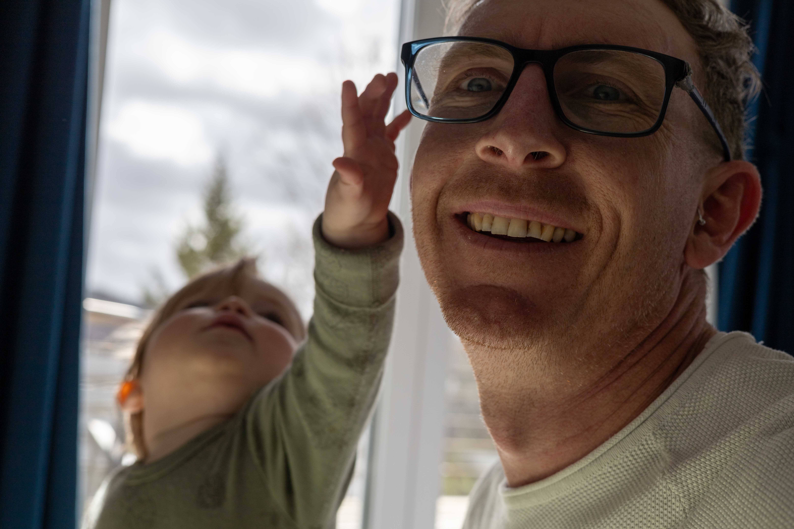
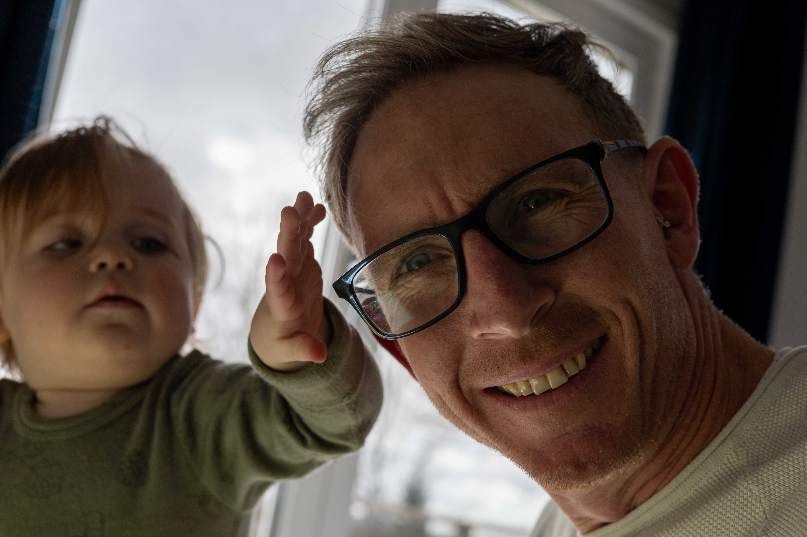
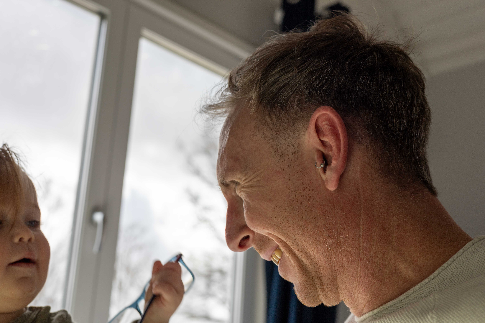
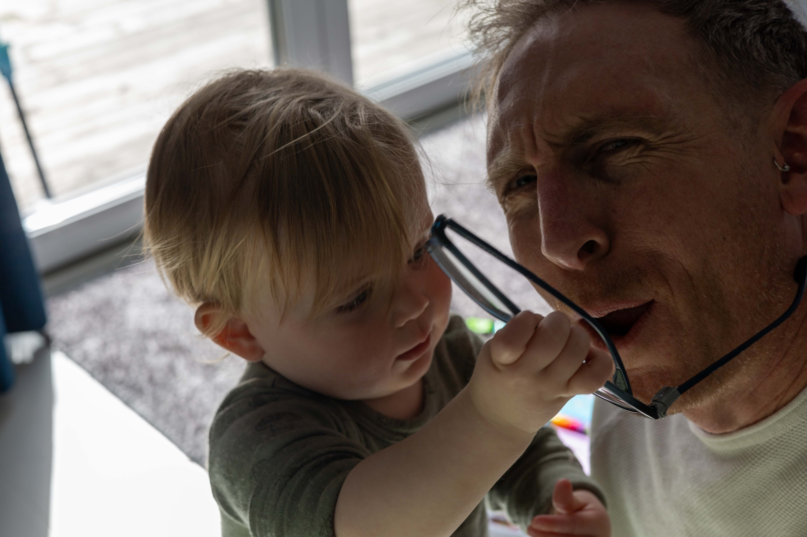
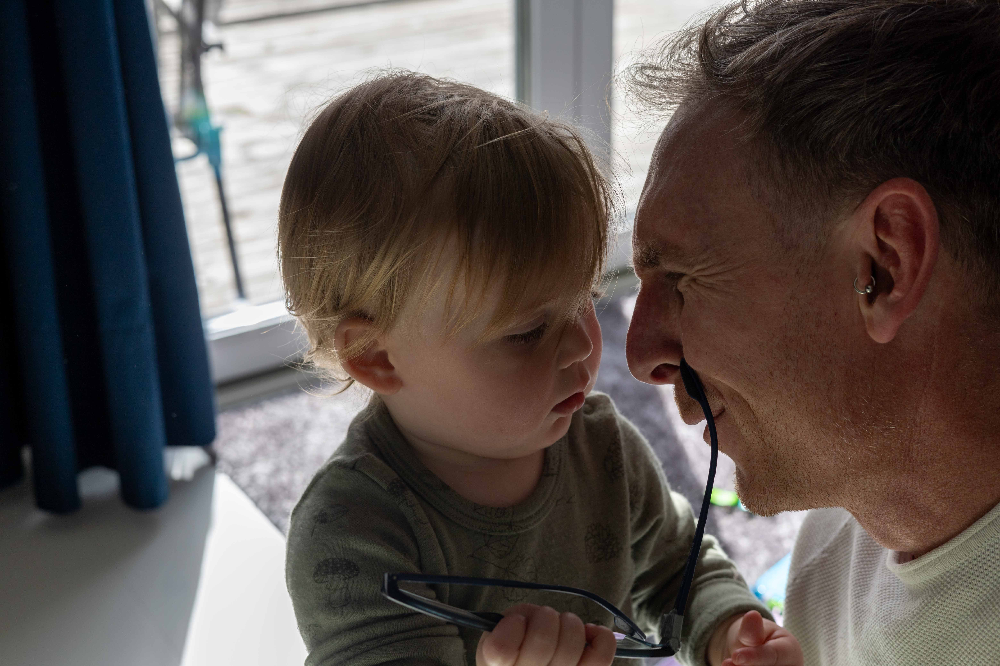
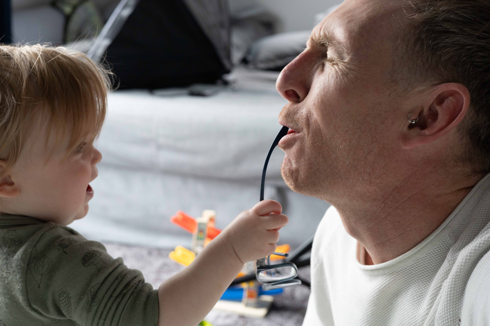
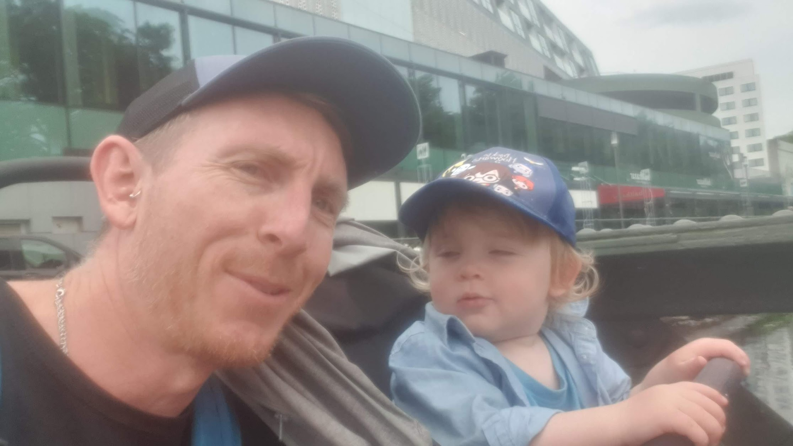

Dear Leo

My darling boy, you are literally the light of my life. Never before have I experienced the depth of love that I feel for you. Your cheeky laugh, our little jokes, your flowing hair and beautiful blue eyes, the way you switch between Swedish and English, how you give me that naughty look before you grab my glasses off my face or throw your sloppy porridge on the floor.

  
  
  
  
  
  

I love it all. Every second. Every joy and every challenge. Having you in my life is the greatest gift I've ever received.

Not being with you every single day breaks my heart. I want you to know that I am sorry that I can't always be there. I hope that in time you will come to understand why I had to leave physically, but also see that I'm always with you in spirit.

Here's why I created this site for you:

- Life can be weird my boy. It can take unexpected turns. But it is in those turns that we grow if we choose to. I want to share some of my thinking with you as it happens to help guide you, even if I'm not around.
- To store our memories: As you will learn, your grandfather died when I was very young. The few memories, pictures, videos, and stories that I do have are precious. I want you to have access to the amazing times that we shared so that you understand your roots in hope that it gives you a strong foundation of who you are in this world.
- As a signpost of growth: I believe that our life's journey is to become a better version of ourselves. I like to call it personal evolution. This journey is never finished because we can always improve. You and I will both make many mistakes along the way, how we decide to respond to them will determine the depth and quality of our lives.
- This will be a way for me to document some of my own journey for you, I hope that it will help you to understand me and our relationship a little better.

So consider this a working homepage.

I'll add to this to try and make it easier for you to navigate through the memories. Some will be easy to find, others may turn up as little discoveries.

I hope that I can sit and share this all with you someday, but if for any reason I can't, know that I will always love you and that I am so so proud of you and I am always with you in spirit.

Love Dad

